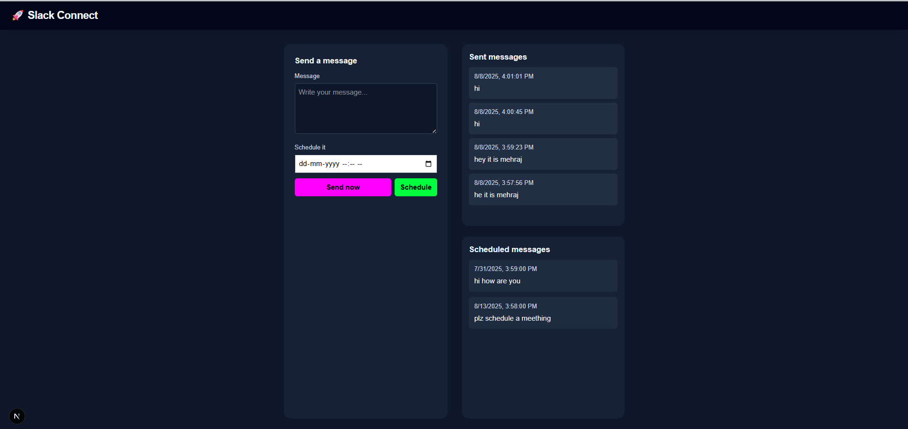

# Slack Message Scheduler

A full-stack web application to authenticate Slack users via OAuth and allow them to schedule messages to be posted in their Slack workspace. The system handles token management and scheduled task processing.

---
## 🖼️ Screenshots

### Home Page

## 🛠️ Setup Instructions

### 1. Clone the Repository
```bash
https://github.com/Mehraj-Dar/Slack-Connect.git
cd Slack-Connect
```

### 2. Backend Setup
```bash
cd backend
npm install
```

#### Configure Environment Variables
Create a `.env` file with the following:
```env
SLACK_CLIENT_ID=your_client_id
SLACK_CLIENT_SECRET=your_client_secret
SLACK_REDIRECT_URI=http://localhost:3000/auth/callback
SESSION_SECRET=some_random_secret
PORT=3000
```

### 3. Frontend Setup
```bash
cd ../frontend
npm install
```

#### Optional: Add .env for frontend if needed

### 4. Run Locally 
In one terminal:
```bash
cd backend
npx nodemon --watch src --exec "node src/app.js"

```

In another terminal:
```bash
cd frontend
npm run dev
```

Open your browser at :
---
   - Local:        http://localhost:3000
   - Network:      http://192.168.187.1:3000

---

## 🏗️ Architectural Overview

### Frontend:
- Built using React + TailwindCSS.
- Authenticates via Slack OAuth.
- Allows message input, recipient selection, and time scheduling.

### Backend:
- Node.js + Express.js server.
- Handles Slack OAuth flow.
- Stores access tokens securely in memory or DB.
- Manages scheduled jobs using `node-cron` or `setTimeout`.
- Communicates with Slack API to send scheduled messages.

### Key Concepts:
- **OAuth**: Redirects to Slack for permission, gets authorization code, exchanges it for access token.
- **Token Management**: Stores tokens linked to Slack users for later API usage.
- **Scheduled Tasks**: On message schedule, backend saves and triggers message dispatch at specified time.

---

## 📌 Features
- Slack OAuth integration
- Message scheduling UI
- Real-time list of scheduled and sent messages
- Backend scheduler for posting messages

---

## ⚠️ Challenges & Learnings

### Challenges:
- **OAuth complexity**: Understanding the OAuth 2.0 flow and configuring proper redirect URIs took time.
- **Scheduling reliability**: Ensuring tasks persist and execute even if the server restarts was a concern.
- **Frontend-backend coordination**: Managing session state and OAuth flow across both parts.

### Learnings:
- Hands-on experience with OAuth 2.0 and API integrations.
- Scheduled task management in Node.js.
- Structuring a full-stack app using React and Express.
- Environment variable security and configuration.


